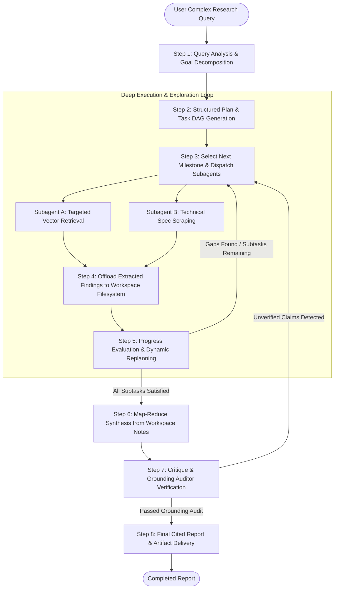

# Deep Agents in RAG: Cost, Complexity, and Workflow Analysis 🧠

This guide provides an engineering and architectural analysis of applying **Deep Agents** (and the modern LangChain Deep Agents harness) to Retrieval-Augmented Generation (RAG). It evaluates whether Deep Agents represent **overkill** for standard RAG, examines their **cost profile**, details their **architectural complexity**, and outlines the **step-by-step workflow** required to build and operate them.

---

## 1. Executive Summary & Verdict: Is Deep Agent an Overkill for RAG?

> [!IMPORTANT]
> **Verdict**: For **90% of production RAG use cases, Deep Agents are complete overkill.**
> 
> However, for the remaining **10% of open-ended, multi-document synthesis and long-horizon research tasks**, they solve fundamental context window and reasoning failure modes that traditional RAG cannot overcome.

### Why It Is Overkill for 90% of RAG Tasks
Most RAG applications solve direct question-answering over indexed documentation:
* *"What is the cancellation policy?"*
* *"How do I configure the Redis port in setting.json?"*
* *"Summarize section 4 of the uploaded quarterly report."*

For these queries:
1. **Latency Penalty**: Users expect answers in **0.8s – 3s**. Deep Agents take **30s – 5+ minutes**.
2. **Cost Explosion**: Deep Agents consume **20x – 100x more tokens** per query than standard RAG pipelines.
3. **Operational Overhead**: Requires distributed state persistence, job queues (Celery/Temporal), sandboxed execution, and subagent concurrency management.
4. **Diminishing Returns**: If the answer is contained within 1 to 3 distinct text chunks, running hierarchical task decomposition, subagent delegation, and workspace scratchpads yields zero accuracy benefit.

### When Deep Agents Are Justified (The 10% Sweet Spot)
Deep Agents become essential when the query demands **long-horizon research, cross-document comparison, and multi-faceted synthesis**:
* *"Compare the risk factors and capital expenditure trajectories across all 25 indexed 10-K filings for Fortune 500 tech companies and synthesize a 10-page audit report."*
* *"Perform an exhaustive codebase security review against OWASP Top 10 and produce a prioritized remediation matrix with code diffs."*
* Tasks where human analysts would spend 2–6 hours searching, reading, taking notes, cross-referencing, and synthesizing.

---

## 2. Standard Agent vs. Deep Agent

In the modern AI ecosystem (specifically LangChain's Deep Agents harness and LangGraph runtime), agents are divided into two distinct architectural classes:

```
┌────────────────────────────────────────────────────────────────────────┐
│                   Standard Agent (Shallow / Single-Loop)               │
│                                                                        │
│   User Query ──► [ LLM (Prompt + Full History) ] ◄──► [ Tools ]        │
│                         │                                              │
│                         ▼ (Appends all raw tool results to history)     │
│                   Final Answer (2-5 steps)                             │
└────────────────────────────────────────────────────────────────────────┘

┌────────────────────────────────────────────────────────────────────────┐
│                   Deep Agent (Hierarchical / Multi-Harness)             │
│                                                                        │
│   User Query ──► [ Lead Orchestrator ] ──► [ Task Planning DAG ]       │
│                         │                                              │
│         ┌───────────────┼───────────────┐                              │
│         ▼               ▼               ▼                              │
│   [ Subagent A ]  [ Subagent B ]  [ Subagent C ]                       │
│    (Topic Alpha)   (Topic Beta)    (Fact Check)                        │
│         │               │               │                              │
│         └───────────────┼───────────────┘                              │
│                         ▼                                              │
│             [ Workspace / Filesystem ]  (Notes, Memos, Outlines)       │
│                         │                                              │
│                         ▼                                              │
│             [ Reflection & Auditor ]                                   │
│                         │                                              │
│                         ▼                                              │
│             Long-Form Research Report (20-100+ steps)                  │
└────────────────────────────────────────────────────────────────────────┘
```

### The 4 Pillars of Deep Agents
1. **Explicit Planning Tools**: The agent creates and maintains a structured task backlog (`pending`, `in_progress`, `completed`). It dynamically adapts its plan as new findings emerge or information gaps are detected.
2. **Workspace / Persistent Filesystem**: Offloads raw data, intermediate summaries, and notes to a virtual or disk-backed filesystem. The LLM's active prompt stays clean, avoiding "lost in the middle" degradation.
3. **Hierarchical Subagent Delegation**: The lead orchestrator spawns specialized, isolated worker subagents. Each subagent solves a specific sub-problem, extracts key insights, and returns only a distilled memo, keeping the main context pristine.
4. **Context Engineering & Compaction**: Employs Recursive Language Models (RLMs), map-reduce passes over document batches, prompt caching, and thread summarization to manage massive token volumes efficiently.

---

## 3. Cost Analysis

The cost difference between standard RAG and Deep Agent RAG is orders of magnitude apart.

### Token Consumption Breakdown per Query

| Metric | Naive RAG | Advanced RAG (RRF) | Agentic RAG (PolyRAG) | Deep Agent RAG |
| :--- | :--- | :--- | :--- | :--- |
| **Number of LLM Calls** | 1 call | 2 – 3 calls | 2 – 5 calls | **20 – 100+ calls** |
| **Input Tokens** | ~1,500 tokens | ~4,000 tokens | ~6,000 tokens | **100,000 – 500,000+ tokens** |
| **Output Tokens** | ~300 tokens | ~400 tokens | ~600 tokens | **5,000 – 25,000 tokens** |
| **Est. Cost (GPT-4o)** | **$0.007** | **$0.015** | **$0.025** | **$0.40 – $2.50+** |
| **Est. Cost (GPT-4o-mini)**| **$0.0003** | **$0.0008** | **$0.0015** | **$0.02 – $0.15** |
| **Median Execution Time**| **0.8 seconds** | **1.8 seconds** | **3.5 seconds** | **45 – 300 seconds** |

### Why Deep Agents Consume So Many Tokens
1. **Planning & Replanning Multipliers**: Formulating a research plan, checking task completion, and adjusting the DAG after every round requires multiple reasoning passes.
2. **Context Duplication Across Subagents**: Every spawned subagent requires its own system prompt, instruction context, and tool definitions.
3. **Exhaustive Retrieval Scraping**: A Deep Agent may retrieve and inspect 50 to 150 document chunks across 10 search iterations, compared to 3–5 chunks in standard RAG.
4. **Intermediate Map-Reduce Passes**: Summarizing large document chunks into research notes before writing the final draft.
5. **Auditor & Grounding Pass**: A dedicated verifier compares the generated draft against all cited passages to eliminate hallucinations.

### Hidden Infrastructure Costs
* **Concurrency & Rate Limits**: Running 4–8 subagents concurrently can instantly exhaust provider TPM (Tokens Per Minute) and RPM (Requests Per Minute) limits without robust queuing.
* **Persistent Storage & Memory**: Requires durable databases (Redis, Postgres, or disk stores) to checkpoint execution state and scratchpad files across long-running tasks.
* **Job Queue Infrastructure**: Cannot run synchronously inside an HTTP request; requires Celery, Temporal, or BullMQ with WebSocket status streaming.

---

## 4. Architectural Complexity Analysis

```
┌─────────────────────────────────────────────────────────────────────────┐
│                      System Complexity Spectrum                         │
│                                                                         │
│  Naive RAG        Advanced RAG       Agentic RAG       Deep Agent RAG   │
│  [Low]            [Low-Medium]       [Medium]          [High-Extreme]   │
│  • Single script  • Multi-query      • Loop controller • State machine  │
│  • Vector store   • RRF merge        • Router JSON     • Subagents      │
│  • 1 LLM call     • Re-ranker        • Reflection      • Filesystem     │
│                                                        • Async queues   │
│                                                        • Checkpoints    │
└─────────────────────────────────────────────────────────────────────────┘
```

### Key Dimensions of Complexity

#### 1. State Machine & Checkpointing
* **Standard RAG**: Stateless. A query goes in, chunks are retrieved, an answer is emitted.
* **Deep Agent**: Stateful. Requires a durable state graph (e.g., LangGraph or custom state machine) that records the current task index, scratchpad files, active subagent conversation threads, and memory checkpoints. If a container crashes on step 37 of 50, the agent must resume from its last checkpoint without restarting from scratch.

#### 2. Cascading Failure Modes
In a multi-agent system, errors compound exponentially:
* **Drift / Topic Hallucination**: A subagent misunderstands an ambiguous sub-question, retrieves irrelevant documents, and writes a flawed memo. The lead orchestrator assumes the memo is factual, polluting the final report.
* **Infinite Replanning Loop**: If the indexed knowledge base does not contain the answer, the agent may perpetually decompose the query into new subtasks, hitting maximum step limits or blowing through token budgets.
* **Subagent Output Formatting Failures**: A subagent returning non-JSON or broken formatting can crash the lead agent's parsing pipeline without defensive validation layers.

#### 3. Asynchronous Orchestration & Timeouts
* Standard REST API endpoints time out after 30 to 60 seconds (Cloudflare, Nginx, AWS ALB).
* Deep Agent execution takes minutes, forcing the architecture to switch to **asynchronous task execution**:
  - Request submission returns `job_id`.
  - Background worker picks up the job.
  - Client polls via SSE (Server-Sent Events) or WebSockets to track live progress, tool invocations, and subagent outputs.

---

## 5. Step-by-Step Workflow (Steps of Work)

Below is the complete end-to-end lifecycle of a Deep Agent RAG execution:



### Detailed Breakdown of Work Steps

#### Step 1: Query Analysis & Goal Decomposition
* The lead orchestrator analyzes the user's objective, identifying:
  - Primary goal.
  - Multi-part constraints (e.g., date ranges, comparisons, file filters).
  - Required output structure (tables, sections, technical memos).

#### Step 2: Structured Plan & Task DAG Generation
* Formulates an explicit, serialized task backlog:
  ```json
  {
    "tasks": [
      {"id": 1, "description": "Retrieve OAuth 2.0 grant types from RFC 6749", "status": "pending"},
      {"id": 2, "description": "Retrieve SAML 2.0 Web Browser SSO profile specifications", "status": "pending"},
      {"id": 3, "description": "Compare token lifecycle, security vulnerabilities, and latency", "depends_on": [1, 2], "status": "pending"}
    ]
  }
  ```

#### Step 3: Hierarchical Subagent Dispatch
* The orchestrator assigns tasks to isolated worker subagents.
* Worker subagents run in sandboxed contexts with specialized instructions and tools (`search_vector_store`, `read_chunk_range`, `filter_by_metadata`).
* They perform iterative searches, inspect candidate chunks, and filter out noise.

#### Step 4: Workspace Filesystem / Scratchpad State Offloading
* Subagents do **not** return raw chunks to the orchestrator.
* Instead, they write findings to the workspace scratchpad:
  - `workspace/notes/oauth2_summary.md`
  - `workspace/notes/saml2_summary.md`
  - `workspace/citations/evidence_index.json`
* Only a concise status memo (`"Completed task 1: extracted 4 grant types and 3 security constraints"`) is returned to the lead orchestrator.

#### Step 5: Progress Evaluation & Dynamic Replanning
* The orchestrator inspects the updated workspace and checks remaining tasks.
* **Gap Analysis**: If findings for task 2 were insufficient, the orchestrator updates the plan, adds subtask `2b`, and dispatches another search with revised query keywords.

#### Step 6: Map-Reduce Synthesis from Workspace Notes
* Once all DAG tasks are completed, the orchestrator reads the organized workspace notes.
* Uses a map-reduce pattern to aggregate notes across sections, structuring the comprehensive report with section headers, comparison tables, and code snippets.

#### Step 7: Critique & Grounding Auditor Verification
* A dedicated **Auditor Subagent** inspects the draft report against `workspace/citations/evidence_index.json`.
* For every factual claim, it checks if a corresponding source chunk exists.
* Unsubstantiated claims are flagged for deletion or trigger a quick targeted re-retrieval.

#### Step 8: Final Report & Artifact Delivery
* The final, verified document is formatted in Markdown with standardized citations (`[RFC6749#chunk_12]`).
* Artifacts (summary tables, JSON metadata, task execution logs) are emitted alongside the response.

---

## 6. Decision Matrix: When to Use What

Use this decision matrix to select the right RAG paradigm in PolyRAG:

| Requirement / Characteristic | Naive RAG | Advanced RAG | Agentic RAG | Deep Agent RAG |
| :--- | :---: | :---: | :---: | :---: |
| **Typical Query Type** | Direct factual lookup | Keyword / semantic mismatch | Multi-hop / ambiguous question | Exhaustive multi-doc research |
| **Number of Sources Needed** | 1 – 3 chunks | 3 – 8 chunks | 5 – 15 chunks | 50 – 200+ chunks |
| **Latency Budget** | < 1 second | 1 – 2 seconds | 2 – 5 seconds | 30 – 300 seconds |
| **Token Budget per Query** | < 2,000 | < 5,000 | < 10,000 | 100,000 – 500,000+ |
| **User Waiting Synchronously** | ✅ Yes | ✅ Yes | ✅ Yes | ❌ No (Async / Streaming) |
| **Task Decomposition Needed** | ❌ No | ❌ No | ⚠️ Query rewrite only | ✅ Explicit DAG planning |
| **Scratchpad / Filesystem** | ❌ None | ❌ None | ❌ None | ✅ Persistent workspace |
| **Subagent Workers** | ❌ None | ❌ None | ❌ None | ✅ Multiple isolated subagents|
| **Recommended in PolyRAG** | `rag.query()` | `rag.create_advanced_rag()` | `rag.create_agentic_rag()` | `rag.create_deep_research_rag()` |

---

## 7. How PolyRAG Applies This Architecture Without Overcomplicating Core Pipelines

PolyRAG avoids monolithic bloat by keeping core pipelines lightweight, fast, and dependency-free, while providing an optional path for deep research:

```
┌────────────────────────────────────────────────────────────────────────┐
│                        PolyRAG Modular Design                          │
│                                                                        │
│   Fast, Synchronous, Core Pipelines (Default)                          │
│   ├── NaiveRAG        (Fastest, single-shot)                           │
│   ├── AdvancedRAG     (Multi-query expansion + RRF rerank)             │
│   ├── AgenticRAG      (Multi-round retrieval + reflection)             │
│   └── ReActAgent      (Lightweight tool-calling loop)                  │
│                                                                        │
│   Heavy, Asynchronous, Deep Research (Optional Specialized Addon)       │
│   └── DeepResearchRAG (Planning DAG + Workspace + Subagents)           │
└────────────────────────────────────────────────────────────────────────┘
```

### The PolyRAG Implementation Principle
1. **Zero Overhead for Standard Users**: Users importing `PolyRAG` or using `NaiveRAG`, `AdvancedRAG`, or `AgenticRAG` never pay the latency, token, or architectural tax of Deep Agents.
2. **Pluggable Workspace**: When using `DeepResearchRAG`, developers can pass an in-memory workspace (`InMemoryWorkspace`) for quick scripts or a disk-backed workspace (`LocalFileSystemWorkspace`) for durable production runs.
3. **Duck-Typed Subagents**: Reuses existing PolyRAG `BaseLLMClient` and `BaseVectorStore` interfaces for subagents without requiring external frameworks.

---

## Summary Checklist for Architects

* [ ] **Are your users asking simple questions?** ➡️ Use **[`NaiveRAG`](../guides/naive-rag.md)** or **[`AdvancedRAG`](../guides/advanced-rag.md)**.
* [ ] **Do queries require multi-step reasoning or disambiguation?** ➡️ Use **[`AgenticRAG`](../guides/agentic-rag.md)**.
* [ ] **Do you need tool invocation in a chat loop?** ➡️ Use **[`ReActAgent`](../guides/react-agent.md)**.
* [ ] **Do you need comprehensive, 10-page synthesized reports across 100+ documents?** ➡️ Only then consider **Deep Agent RAG**.
